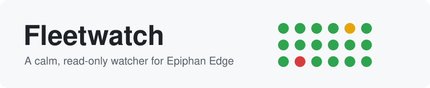
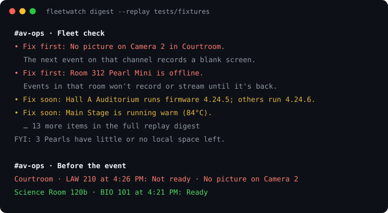
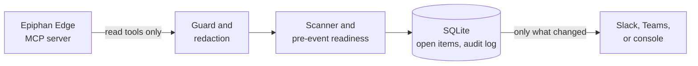

<p align="right">English · <a href="README.es.md">Español</a></p>

<p align="center">
  <picture>
    <source media="(prefers-color-scheme: dark)" srcset="docs/assets/banner-dark.svg">
    
  </picture>
</p>

<p align="center">
  <a href="https://github.com/ScientiaCapital/fleetwatch/actions/workflows/ci.yml"></a>
  <a href="https://scientiacapital.github.io/fleetwatch/"></a>
  <a href="https://www.python.org/"></a>
  <a href="https://github.com/ScientiaCapital/fleetwatch/releases"></a>
  <a href="LICENSE"></a>
</p>

<p align="center">
  <a href="https://scientiacapital.github.io/fleetwatch/">Docs</a> ·
  <a href="#install">Install</a> ·
  <a href="SECURITY.md">Security</a>
</p>

# Fleetwatch for Epiphan Edge

An always-on, read-only watcher for your Epiphan Edge fleet. It checks every room on a heartbeat, posts a calm
Slack or Microsoft Teams digest when something changes, and says Ready or Not ready 30 minutes before each scheduled
event.

Version 0.1 is observe-only. Fleetwatch never calls a write tool: its client refuses them before any request
leaves the machine, and `policy.yaml` accepts only `autonomy: observe` or `propose` (`propose` is for the optional v0.2 assistant, below). The Epiphan sign-in it stores can write, so
use a least-access account.

<p align="center">
  
</p>

<p align="center"><sub>From <code>fleetwatch digest --replay tests/fixtures</code>: a sample fleet, no real data.</sub></p>

## What you get

| | |
|---|---|
| Calm digest | Posts only when something changes. Each problem is posted once, reminded at most every four hours, and closed with Back to normal. |
| Ready or Not ready | 30 minutes before each scheduled event, one line per room: Ready, Ready with notes, or Not ready. Is the picture there, is the unit online? Posted again if that changes before the start. |
| Refuses write tools in code | The client refuses write tools before any request leaves the machine. The stored sign-in can still write, because Epiphan Edge has no read-only sign-in, so use a least-access account. |
| Built for a Pi or a Mac mini | One-line install as a systemd or launchd service, or Docker. |
| `fleetwatch doctor` | One line per check: version, policy, guard, redaction, sign-in, state folder, Slack and Teams, network, and service. |
| Offline demo | A full heartbeat against a saved sample fleet, or a calm one for a screen in a quiet room. No account, no network. |

## Install

macOS or Linux, one line. It installs [uv](https://docs.astral.sh/uv/) if needed, signs you in to Epiphan Edge,
and installs the always-on service. [Read the script](install.sh) first if you like.

```bash
curl -fsSL https://raw.githubusercontent.com/ScientiaCapital/fleetwatch/main/install.sh | bash
```

It installs the newest release (until the first one is tagged, the `main` branch); add `-s -- --ref main` for
the development branch.

Prefer Docker? From a clone of the repo, `docker compose run --rm fleetwatch login`, then `docker compose up -d`.
Until the first release, Compose builds the image locally.

| Tier | Platform | Runs as |
|---|---|---|
| 1 | macOS on Apple Silicon, such as a Mac mini | launchd agent |
| 1 | Raspberry Pi 5 / Linux aarch64 | systemd user unit |
| 1 | Docker, amd64 and arm64 | container (`compose.yaml`) |
| 2 | Linux x86_64, macOS on Intel | systemd / launchd |

On every pull request, continuous integration (CI) runs the tests and the installer dry run on GitHub-hosted macOS
(Apple Silicon) and Linux aarch64 machines, runs the tests on Python 3.12 and 3.13, and builds and runs the Docker
image for amd64 and for arm64 (arm64 under emulation). A real Raspberry Pi 5 and Mac mini haven't been checked yet.
Step-by-step guides:
[Mac mini](https://scientiacapital.github.io/fleetwatch/mac-mini/),
[Raspberry Pi](https://scientiacapital.github.io/fleetwatch/raspberry-pi/),
[Docker](https://scientiacapital.github.io/fleetwatch/docker/).

## Updating

Run the install line again. It moves `~/fleetwatch` to the newest release, installs its dependencies, and restarts
the service. Your `.env`, sign-in, and history stay put: the SQLite state lives in `~/.fleetwatch`, and the sign-in
token in the macOS Keychain or that same folder, all outside the code folder.

```bash
curl -fsSL https://raw.githubusercontent.com/ScientiaCapital/fleetwatch/main/install.sh | bash
```

To pick a version, add `-s -- --ref v0.1.0` (any release tag, or `main` for the development branch). If you
cloned the repo yourself, run `git pull && uv sync` in its folder, then `deploy/install.sh` to restart the service.

On Docker, `docker compose pull && docker compose up -d` fetches the newest image from the GitHub Container
Registry and restarts the container. The `fleetwatch-state` volume keeps the sign-in and history. To stay on one
version, set `image:` in `compose.yaml` to a release tag, such as `ghcr.io/scientiacapital/fleetwatch:0.1.0`, or
`:0.1` for its patch updates. Until the first release is out there's no image to pull, so run
`docker compose up -d --build` instead.

Afterwards, `fleetwatch doctor` shows the version on its first line. Each release on
[GitHub Releases](https://github.com/ScientiaCapital/fleetwatch/releases) lists what changed.

## Quick start

No account handy? Run a full heartbeat against a saved, redacted fleet sample:

```bash
git clone https://github.com/ScientiaCapital/fleetwatch.git && cd fleetwatch
uv sync
uv run fleetwatch digest --replay tests/fixtures
uv run fleetwatch digest --replay tests/fixtures/calm   # a quiet fleet: All clear and one Ready check
```

With your own team:

```bash
cp .env.example .env            # Slack bot token and channel; leave the token empty to print to the console
uv run fleetwatch connect       # guided first run: your region, sign-in to Epiphan Edge, a check that the team shows devices
uv run fleetwatch digest        # one heartbeat, prints or posts the digest
uv run fleetwatch digest --capture ~/fleetwatch-capture   # also save what it read, redacted, as a replay sample
uv run fleetwatch run           # keep going, every three minutes
uv run fleetwatch status        # signed in? open items?
uv run fleetwatch doctor        # is this machine ready? one line per check
uv run fleetwatch ask "is Main Stage ready"   # ask in plain words; --serve opens a page with buttons
uv run fleetwatch history       # one line per day: fleet size, online, posts, nightly sweep
uv run fleetwatch note "Room 204 Pearl Mini" "Bulb replaced"   # a note shown under that room's items
uv run fleetwatch notes --search bulb                           # list notes: all, one room, or by text
deploy/install.sh               # run it as a service: launchd on macOS, systemd on Linux
```

On a headless Pi, open the sign-in link on any device. If the final `127.0.0.1` page can't load, paste its URL
back into the terminal. Europe or Australia accounts set `FLEETWATCH_EPIPHAN_MCP_URL` to
`https://eu.epiphan.cloud/mcp` or `https://au.epiphan.cloud/mcp`.

What a digest looks like:

```text
*Fleet check*
• *Fix first*: Room 312 Pearl Mini is offline. Events in that room won't record or stream until it's back.
• *Fix soon*: Hall A Auditorium runs firmware 4.24.5; others like it run 4.24.6. Works fine today; keeps the fleet consistent.
• *Fix soon*: Room 312 EC20 is offline. Its picture may be missing from the Pearl channels that use it, and Edge can't control it.
FYI: 3 Pearls have little or no local space left. That's normal when recordings upload to your CMS.
```

- The same problem is posted once, reminded at most every four hours, and closed with Back to normal.
- Quiet hours (22:00 to 06:30 by default) only let Fix first items and before-event checks through.
- Before each event: `Ballroom B · Opening keynote at 9:00 AM: Ready, with notes`. If the verdict changes before the
  start, one more line says so: `Now not ready (was Ready)` or `Ready now (was Not ready)`.
- Say `vertical: education`, `business`, `courts`, or `worship` in `policy.yaml` and the words change: class, meeting,
  hearing, service.

## How it fits together



Each heartbeat reads the fleet through Epiphan's Model Context Protocol (MCP) server, then runs plain code: fixed
checks, a diff against SQLite, and a template message. It makes no large language model (LLM) call.

| Path | What it does |
|---|---|
| `policy.yaml` | Heartbeat, quiet hours, scope, thresholds |
| `tool_policy.yaml` | Which Epiphan tools may be called; only `read` is ever used |
| `src/fleetwatch/epiphan/` | OAuth sign-in, read-only MCP client with the guard, parsers, replay |
| `src/fleetwatch/agents/` | What needs attention, Ready / Not ready, room state |
| `src/fleetwatch/heartbeat.py` | One tick: read, diff, post once |
| `src/fleetwatch/redact.py` | Masks known secret shapes (stream keys, credentialed URLs, tokens) before anything is parsed, stored, logged, or posted. New shapes get a test in `tests/test_redact.py` |
| `deploy/` | launchd agent, systemd unit, `install.sh` |

## Troubleshooting

Start with `fleetwatch doctor`. It signs in to nothing and calls no tools, so it's safe to run anywhere:

```text
OK    Version            fleetwatch 0.1.0, Python 3.12.4 on arm64
OK    Policy             observe-only, heartbeat every 180 s
OK    Read-only guard    20 read tools allowed; every write tool is refused
OK    Redaction          stream keys and credentialed URLs are masked
WARN  Sign-in            not signed in: run  fleetwatch login
OK    State folder       /Users/you/.fleetwatch (created on first run)
OK    Slack              no token: prints to the console
OK    Slack commands     off (set FLEETWATCH_SLACK_APP_TOKEN to answer /fleetwatch)
OK    Teams              not configured
OK    Epiphan reachable  go.epiphan.cloud
WARN  Service            launchd agent not installed: run  deploy/install.sh

Nothing broken. 2 to look at.
```

| Symptom | Fix |
|---|---|
| `Sign-in` is WARN or FAIL | Run `fleetwatch login`. On a headless Pi, open the link on any device and paste the final `127.0.0.1` URL back. |
| `Epiphan reachable` fails | Check the network, or set `FLEETWATCH_EPIPHAN_MCP_URL` to your region (`https://eu.epiphan.cloud/mcp` or `https://au.epiphan.cloud/mcp`). |
| Nothing posts to Slack | No token means the console only. Set `FLEETWATCH_SLACK_BOT_TOKEN` (`chat:write`) and invite the bot to the channel. |
| A digest never repeats | That's on purpose. An open problem is reminded at most every four hours. `fleetwatch status` lists open items. |
| No network at all | `fleetwatch digest --replay tests/fixtures` runs the full heartbeat offline; `tests/fixtures/calm` is a quiet fleet. |

Still stuck? Open an [issue](https://github.com/ScientiaCapital/fleetwatch/issues) with the `doctor` output.

## Security

Fleetwatch only reads. It listens on no network port except `127.0.0.1`, and only during `fleetwatch login` or while
you run `fleetwatch ask --serve`. It talks only outward, to your Epiphan region and to Slack or Teams. It redacts every tool result before it parses,
stores, logs, or posts it. Redaction is a real boundary: some read tools (`get_stream_endpoint`,
`get_stream_endpoints`, `get_channel_image`) can return secrets, and it only catches the shapes it knows. It treats
device and event names as untrusted data. The OAuth token refreshes itself and
is kept in the macOS Keychain, encrypted with `systemd-creds`, or in a mode `600` file.

Epiphan Edge has no read-only sign-in: the token can do whatever the Edge account can in that team. Fleetwatch never
uses that power, because the guard refuses every write tool, but a stolen token could. So sign in with a dedicated
account that has the least access that still sees the rooms you watch, and treat the token like a password.
`fleetwatch doctor` reminds you whenever a sign-in is stored.

The [trust model](SECURITY.md#trust-model), what is in and out of scope, and known limits are in
[SECURITY.md](SECURITY.md). Report vulnerabilities privately through
[GitHub security advisories](https://github.com/ScientiaCapital/fleetwatch/security/advisories/new).

### Assistant (v0.2, optional)

Built but not released, and tested only against fakes and mocks: a fake Epiphan server and a mocked model. It has not
run against a real team or the live Anthropic API.

With `FLEETWATCH_ANTHROPIC_API_KEY` set, `fleetwatch ask` uses Claude Haiku 5.5 to answer in plain English or
Spanish. It reads the fleet through the same read-only guard. It can't change anything. When `policy.yaml` says
`autonomy: propose`, it can store a proposed change, nothing more.

- A person approves each change, one at a time, on a local page: `fleetwatch approve --serve`. See
  [Approving changes](docs/approving-changes.md).
- Changes run on a sandbox team only, through a separate sign-in (`fleetwatch login --sandbox`).
- Each approval works once, expires after five minutes, and is bound to the exact tool and arguments.
- Disruptive tools, such as a reboot or a firmware update, are refused near a scheduled event or while a room is
  recording, even with approval.

When it's on, your question and redacted fleet data, including device, channel and event names, go to the Anthropic API.
To turn it off, leave `FLEETWATCH_ANTHROPIC_API_KEY` empty, or use `ask --no-ai` for one question. If the API can't be
reached, `ask` gives the keyword answer and says so. `fleetwatch doctor` shows whether the assistant is on. The
trust model and its known limits are in [SECURITY.md](SECURITY.md#v02-trust-model).

## Documentation

[scientiacapital.github.io/fleetwatch](https://scientiacapital.github.io/fleetwatch/): install, sign-in, policy,
what it posts, the security model, running on a Mac mini or a Pi, Docker, and replay mode.

## Development

```bash
uv sync
uv run python -m pytest -q
uv run ruff check . && uv run ruff format --check .
uv run fleetwatch digest --replay tests/fixtures
deploy/install.sh --dry-run
```

CI runs lint, tests on macOS and Linux (x86 and ARM), the redaction suite, a replay heartbeat, the installer dry
runs, the Docker image, the docs build, CodeQL, pip-audit, dependency review, actionlint, and zizmor on every pull
request.

## Contributing

Bug reports with a redacted replay sample (`fleetwatch digest --capture DIR` writes one), new checks, and redaction cases help
most. Read [CONTRIBUTING.md](CONTRIBUTING.md). AI assistants should read [AGENTS.md](AGENTS.md).

## Community

Questions and ideas go in [GitHub Discussions](https://github.com/ScientiaCapital/fleetwatch/discussions). Bugs
and feature requests go in [issues](https://github.com/ScientiaCapital/fleetwatch/issues). Everyone follows the
[Code of Conduct](CODE_OF_CONDUCT.md).

## Status

Version 0.1.0, not released yet. Unit and replay tests pass. Fleetwatch has only run against the saved sample fleet
so far: the first live run against a real team is still to do. What's next is in the
[Sprint 2](https://github.com/ScientiaCapital/fleetwatch/milestone/1) and
[Sprint 3](https://github.com/ScientiaCapital/fleetwatch/milestone/2) milestones, including a voice interface that
isn't built yet. The optional assistant that proposes changes for a person to approve is built but not released, and
chat wiring is still in progress. It's untested against a real team. It won't run disruptive actions unattended. The
guard, the dry run, and the redaction stay.

## Thanks

Huge thanks to the Epiphan engineering team for building Epiphan Edge and the Epiphan MCP server. Fleetwatch
sits entirely on what they built, and it's only going to keep getting better.

## License

Copyright 2026 Epiphan Systems Inc. Licensed under [Apache-2.0](LICENSE); see [NOTICE](NOTICE) for attributions.
Built from the [Epiphan Edge Claude Kit](https://github.com/ScientiaCapital/epiphan-edge-claude-kit) (MIT).

Fleetwatch is not an officially supported Epiphan product. Epiphan, Epiphan Edge, Pearl, and EC20 are trademarks
of Epiphan Systems Inc.
