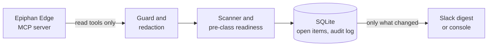

<p align="center">
  <picture>
    <source media="(prefers-color-scheme: dark)" srcset="docs/assets/banner-dark.svg">
    
  </picture>
</p>

<p align="center">
  <a href="https://github.com/ScientiaCapital/fleetwatch/actions/workflows/ci.yml"></a>
  <a href="https://scientiacapital.github.io/fleetwatch/"></a>
  <a href="https://www.python.org/"></a>
  <a href="LICENSE"></a>
</p>

<p align="center">
  <a href="https://scientiacapital.github.io/fleetwatch/">Docs</a> ·
  <a href="#install">Install</a> ·
  <a href="https://scientiacapital.github.io/fleetwatch/booth/">Booth guide</a> ·
  <a href="SECURITY.md">Security</a> ·
  <a href="README.es.md">Español</a>
</p>

# Fleetwatch for Epiphan Edge

**An always-on, read-only watcher for your Epiphan Edge fleet.** It checks every room on a heartbeat, posts a calm
Slack digest when something changes, and says **Ready** or **Not ready** 30 minutes before each scheduled class.

v0.1 is **observe-only**. It can't change a device: write tools are refused inside the client before any request
leaves the machine, and `policy.yaml` is forced to `autonomy: observe`.

<p align="center">
  
</p>

<p align="center"><sub>From <code>fleetwatch digest --replay tests/fixtures</code>: a sample fleet, no real data.</sub></p>

## What you get

| | |
|---|---|
| **Calm digest** | Posts only when something changes. Each problem is posted once, reminded at most every 4 hours, and closed with *Back to normal*. |
| **Ready / Not ready** | 30 minutes before each scheduled class, one line per room: is the picture there, is the unit online. |
| **Read-only by construction** | Write tools are refused inside the client, before any request leaves the machine. |
| **Runs on a Pi or a Mac mini** | One-line install as a systemd or launchd service, or Docker on amd64 and arm64. |
| **`fleetwatch doctor`** | One line per check: policy, guard, redaction, sign-in, network, service. |
| **Offline demo** | A full heartbeat against a saved sample fleet. No account, no network. |

## Install

macOS or Linux, one line. It installs [uv](https://docs.astral.sh/uv/) if needed, signs you in to Epiphan Edge,
and installs the always-on service. [Read the script](install.sh) first if you like.

```bash
curl -fsSL https://raw.githubusercontent.com/ScientiaCapital/fleetwatch/main/install.sh | bash
```

Prefer Docker? `docker compose run --rm fleetwatch login`, then `docker compose up -d`.

| Tier | Platform | Runs as |
|---|---|---|
| 1 | macOS on Apple Silicon, e.g. a Mac mini | launchd agent |
| 1 | Raspberry Pi 5 / Linux aarch64 | systemd user unit |
| 1 | Docker, amd64 and arm64 | container (`compose.yaml`) |
| 2 | Linux x86_64, macOS on Intel | systemd / launchd |

Tier 1 targets are tested in CI on every pull request. Step-by-step guides:
[Mac mini](https://scientiacapital.github.io/fleetwatch/mac-mini/),
[Raspberry Pi](https://scientiacapital.github.io/fleetwatch/raspberry-pi/),
[Docker](https://scientiacapital.github.io/fleetwatch/docker/).

## Quick start

No account handy? Run a full heartbeat against a saved, redacted fleet sample:

```bash
git clone https://github.com/ScientiaCapital/fleetwatch.git && cd fleetwatch
uv sync
uv run fleetwatch digest --replay tests/fixtures
```

With your own team:

```bash
cp .env.example .env            # Slack bot token and channel; leave the token empty to print to the console
uv run fleetwatch login         # one-time sign-in to Epiphan Edge; pick the team to watch
uv run fleetwatch digest        # one heartbeat, prints or posts the digest
uv run fleetwatch run           # keep going, every 3 minutes
uv run fleetwatch status        # signed in? open items?
uv run fleetwatch doctor        # is this machine ready? one line per check
deploy/install.sh               # run it as a service: launchd on macOS, systemd on Linux
```

On a headless Pi, open the sign-in link on any device. If the final `localhost` page can't load, paste its URL
back into the terminal. Europe or Australia accounts set `FLEETWATCH_EPIPHAN_MCP_URL` to `eu.` or
`au.epiphan.cloud`.

What a digest looks like:

```text
*Fleet check*
• *Fix first*: Room 312 Pearl Mini is offline. Classes in that room won't record or stream until it's back.
• *Fix soon*: Hall A Auditorium runs firmware 4.24.5; others like it run 4.24.6. Works fine today.
FYI: 3 Pearls have little or no local space left. That's normal when recordings upload to your CMS.
```

- The same problem is posted once, reminded at most every 4 hours, and closed with **Back to normal**.
- Quiet hours (22:00 to 06:30 by default) only let *Fix first* items through.
- Before each class: `Room 204 · BIO 101 at 2:00 PM: Ready, with notes`.

## How it fits together



Each heartbeat is plain code: fixed checks, a diff against SQLite, and a template message. No LLM call is made.

| Path | What it does |
|---|---|
| `policy.yaml` | Heartbeat, quiet hours, scope, thresholds |
| `tool_policy.yaml` | Which Epiphan tools may be called; only `read` is ever used |
| `src/fleetwatch/epiphan/` | OAuth sign-in, read-only MCP client with the guard, parsers, replay |
| `src/fleetwatch/agents/` | What needs attention, Ready / Not ready, room state |
| `src/fleetwatch/heartbeat.py` | One tick: read, diff, post once |
| `src/fleetwatch/redact.py` | Stream keys and credentialed URLs never reach a log or a message |
| `deploy/` | launchd agent, systemd unit, `install.sh` |

## Troubleshooting

Start with `fleetwatch doctor`. It signs in to nothing and calls no tools, so it is safe to run anywhere:

```text
OK    Policy             observe-only, heartbeat every 180 s
OK    Read-only guard    20 read tools allowed; every write tool is refused
WARN  Sign-in            not signed in: run  fleetwatch login
OK    Epiphan reachable  go.epiphan.cloud
WARN  Service            launchd agent not installed: run  deploy/install.sh

Nothing broken. 2 to look at.
```

| Symptom | Fix |
|---|---|
| `Sign-in` is WARN or FAIL | Run `fleetwatch login`. On a headless Pi, open the link on any device and paste the final `localhost` URL back. |
| `Epiphan reachable` fails | Check the network, or set `FLEETWATCH_EPIPHAN_MCP_URL` to your region (`eu.` or `au.epiphan.cloud`). |
| Nothing posts to Slack | No token means the console only. Set `FLEETWATCH_SLACK_BOT_TOKEN` (`chat:write`) and invite the bot to the channel. |
| A digest never repeats | That's on purpose. An open problem is reminded at most every 4 hours. `fleetwatch status` lists open items. |
| No network at all | `fleetwatch digest --replay tests/fixtures` runs the full heartbeat offline. |

Still stuck? Open an [issue](https://github.com/ScientiaCapital/fleetwatch/issues) with the `doctor` output.

## Security

Fleetwatch only reads. It listens on no network port except `127.0.0.1` for the few seconds of `fleetwatch login`,
and talks only outward, to your Epiphan region and Slack. Every tool result is redacted before it is parsed,
stored, logged or posted. Device and event names are treated as untrusted data. The OAuth token is stored with
mode `600` and refreshes itself. The guard runs inside the process, so the boundaries that hold against an
attacker are the OS user that runs Fleetwatch and the permissions of the Edge account you sign in with.

The [trust model](SECURITY.md#trust-model), what is in and out of scope, and known limits are in
[SECURITY.md](SECURITY.md). Report vulnerabilities privately through
[GitHub security advisories](https://github.com/ScientiaCapital/fleetwatch/security/advisories/new).

## Documentation

[scientiacapital.github.io/fleetwatch](https://scientiacapital.github.io/fleetwatch/): install, sign-in, policy,
what it posts, the security model, running on a Mac mini or a Pi, Docker and replay mode.

## Development

```bash
uv sync
uv run python -m pytest -q
uv run ruff check . && uv run ruff format --check .
uv run fleetwatch digest --replay tests/fixtures
deploy/install.sh --dry-run
```

CI runs lint, tests on macOS and Linux (x86 and ARM), the redaction suite, a replay heartbeat, the installer dry
runs, the Docker image, CodeQL, pip-audit, dependency review, actionlint and zizmor on every pull request.

## Contributing

Bug reports with a redacted replay sample, new checks and redaction cases help most. Read
[CONTRIBUTING.md](CONTRIBUTING.md). AI assistants should read [AGENTS.md](AGENTS.md).

## Community

Questions and ideas go in [GitHub Discussions](https://github.com/ScientiaCapital/fleetwatch/discussions). Bugs
and feature requests go in [issues](https://github.com/ScientiaCapital/fleetwatch/issues). Everyone follows the
[Code of Conduct](CODE_OF_CONDUCT.md).

## Status

v0.1. Unit and replay tests pass. The first live run against a real team is still to do. What's next is in
[docs/next-sprint.md](docs/next-sprint.md) and the
[Sprint 2 milestone](https://github.com/ScientiaCapital/fleetwatch/milestone/1). Later versions add
proposals with Slack approval, then routine fixes on their own; the guard, the dry run and the redaction stay.

## License

Copyright 2026 Epiphan Systems Inc. Licensed under [Apache-2.0](LICENSE); see [NOTICE](NOTICE) for attributions.
Built from the [Epiphan Edge Claude Kit](https://github.com/ScientiaCapital/epiphan-edge-claude-kit) (MIT).

Fleetwatch is not an officially supported Epiphan product. Epiphan, Epiphan Edge, Pearl and EC20 are trademarks
of Epiphan Systems Inc.
