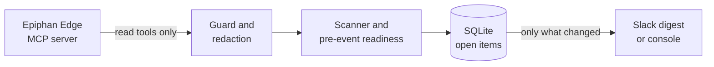

# Fleetwatch for Epiphan Edge

An always-on, read-only watcher for an Epiphan Edge fleet. It checks every room on a heartbeat, posts a calm Slack
or Microsoft Teams digest when something changes, and says Ready or Not ready 30 minutes before each scheduled event.

Version 0.1 is observe-only. It can't change a device: the client refuses write tools before any request
leaves the machine.

- New here? Start with [Install](install.md), or try it with no account in [Replay mode](replay.md).
- Deciding whether to trust it? Read the [Security model](security.md).
